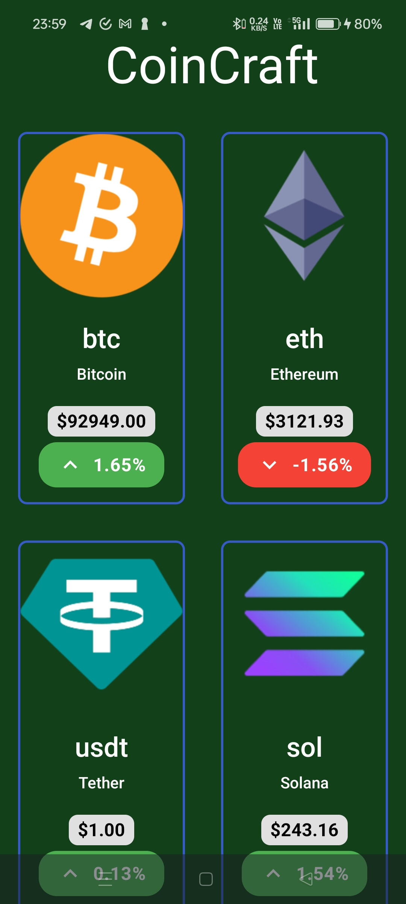

# CoinCraft - Cryptocurrency Price Tracker

**CoinCraft** is a modern and stylish cryptocurrency tracking app built using **Jetpack Compose** and powered by the **CoinGecko API**. With an intuitive user interface, CoinCraft provides real-time price updates, rankings, and market trends for your favorite cryptocurrencies.

## Features

- 🔥 **Real-time Price Tracking**: Get the latest prices of top cryptocurrencies like Bitcoin, Ethereum, Dogecoin, and more.
- 📈 **Market Trends**: Stay updated on daily percentage changes and identify market movements at a glance.
- 🏆 **Ranked Listings**: View cryptocurrencies ranked based on market cap and popularity.
- ✨ **Modern UI Design**: A sleek and user-friendly interface developed with Jetpack Compose for a seamless user experience.
- ⚡ **Lightweight & Fast**: Optimized for performance to deliver data quickly.

## Screenshots

### Home Page


### Coin Details


## Technology Stack

- **Android Development**: [Jetpack Compose](https://developer.android.com/jetpack/compose) for declarative UI.
- **API Integration**: [CoinGecko API](https://www.coingecko.com/en/api) for fetching cryptocurrency data.
- **Kotlin**: Fully written in Kotlin for concise and efficient code.

## Getting Started

### Prerequisites

- Android Studio Arctic Fox or later.
- Minimum Android SDK 21 (Lollipop).

### Setup Instructions

1. Clone the repository:
   ```bash
   git clone https://github.com/yourusername/coincraft.git
   cd coincraft
   ```
2. Open the project in Android Studio.
3. Obtain your free API key from [CoinGecko API](https://www.coingecko.com/en/api) (if required).
4. Add the API key to your project:
   - Navigate to `local.properties`.
   - Add the line:
     ```properties
     API_KEY=your_api_key_here
     ```
5. Build and run the app on your preferred Android device or emulator.

## Contributing

We welcome contributions! If you want to enhance CoinCraft or fix any issues, please follow these steps:

1. Fork the repository.
2. Create a new branch (`git checkout -b feature-branch-name`).
3. Commit your changes (`git commit -m 'Add some feature'`).
4. Push to the branch (`git push origin feature-branch-name`).
5. Create a pull request.

